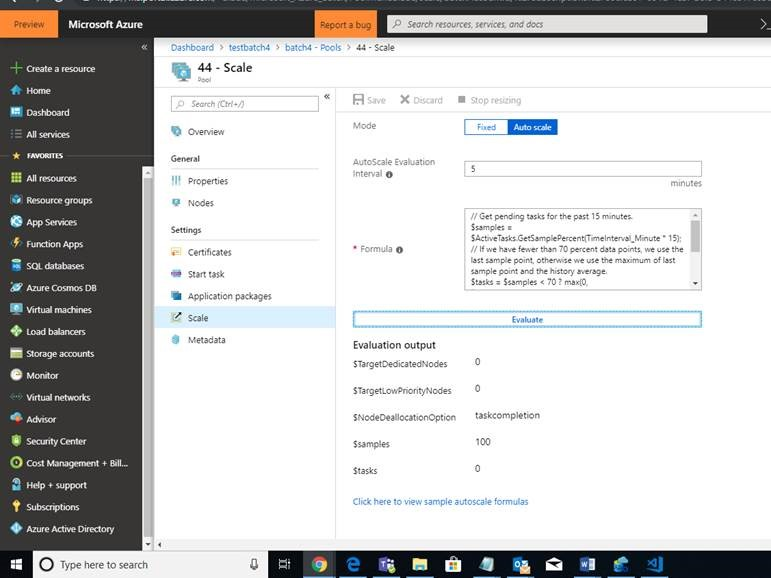

# Make changes to the Batch Account to autoscale from 0 to 1 node depending on Pending Tasks
Logic in the Formula:  

* // Get pending tasks for the past 15 minutes.  
`$samples = $ActiveTasks.GetSamplePercent(TimeInterval_Minute * 15);`  
* // If we have fewer than 70 percent data points, we use the last sample point, otherwise we use the maximum of last sample point and the history average.   
`$tasks = $samples < 70 ? max(0, $ActiveTasks.GetSample(1)) :  
max( $ActiveTasks.GetSample(1), avg($ActiveTasks.GetSample(TimeInterval_Minute * 15)));`   
* // If there are no active tasks, set the number of nodes to 0; otherwise provision 1 node   
`$TargetDedicated = $tasks > 1 ? 1 : 0; $NodeDeallocationOption = taskcompletion; 
`
  
